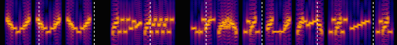

## MIDI-Synth Hellschreiber

### What is this sketch? What is it used for?

This sketch generates the following three types of multi-tone Hellschreiber (MT-Hell) signals with the help of an external MIDI-capable sound module: Chirped Hell, concurrent MT-Hell, and sequential MT-Hell. It can be used for beacons, propagation tests, experimentation, and more.

The Hellschreiber is not a brand new, cutting-edge digital mode. In fact, It is a facsimile-like system that was invented by German engineer Rudolf Hell in the late 1920s. It was primarily used by press services (used for military purposes during World War II). Even today, amateur radio operators use it for radio communication.

>[!TIP]
>*Schreiben* is a German verb meaning "to write" and *hell* is a German adjective meaning "bright". Therefore, *Hellschreiber* has two meanings: "Hell's bright (clear) writer" and "writer developed by Hell," in my opinion.

After many years, a number of variants have emerged. One of these is the multi-tone Hellschreiber. It is radio amateurs who developed many of these variants in the 1990s. Unfortunately, these variants, as well as other modern digital modes, require a lot of resources; they need a fast CPU and plenty of memory for signal processing but most of recent PCs can handle it with ease. Even a single-board computer like the `Raspberry Pi Zero` is far more powerful than you might imagine. It can perform a Fast Fourier Transform (FFT) on the fly.

MT-Hell converts images into sounds (tones) suitable for transmission. Each row of pixels in a character corresponds to a different frequency. Upon reception, these transmitted characters can be read using a FFT display, also known as a waterfall plot, which converts the signal back into a form that can be read by humans.



As mentioned above, pixels of characters are simply converted into tones and sent __without__ encoding, compression, or synchronization. Received signals are displayed on the FFT display as gray-scale pixels, __without__ decoding or error correction. Reading what was sent is totally up to the human operator and not determined by a decoding program. These characteristics differ from those of popular digital modes, such as `FT8`, `JT65`, `PSK31`, and `RTTY`.

These characteristics provide programmers with a wide range of flexibility for implementation, improvement, and experimentation. These changes can be made freely without affecting existing programs.

As you may have noticed, precise tone generation is an essential part of the system. An electronic musical instrument, or sound module, is also an excellent audio signal generator because it has a buit-in fine-tuning feature. I had great success with the `Unit-Synth` and the `Unit-MIDI` from the M5STACK team, both of which use the `SAM2695` synthesizer chip. However, other external hardware sound modules, such as the `Roland SC-55Mk2` or the `YAMAHA MU-80`, can be used for this purpose, provided they are MIDI-based.

### Requirements

* An Arduino Nano Every (not Nano)
* An MIDI-capable sound module (e.g., Unit-Synth or Unit-MIDI for M5Stack)

> [!NOTE]
> According to my experience, avoid the VS1053b-based module like the plague due to its very poor tone tuning capability.


### Testing

The easiest way to test this sketch is to connect the `Unit-Synth` to the Arduino Nano Every and observe the result in the [Spectrum Lab](https://www.qsl.net/dl4yhf/spectra1.html) FFT waterfall plot pane. For wiring instructions, refer to [midihell.pdf](./extras/midihell.pdf) in this directory.

### MIDI HELL CLI

The MIDI HELL CLI (`hell`) is a command-line interface designed for use with a serial console (9600bps, 8-data bit, no parity and 1-stop bit). 

* Available commands
  * hell mode
  * hell msg
* Usage examples

```
// Switch to CMT-Hell mode
hell mode 0
// help
hell mode help
// Select message #2
hell msg 1
// help
hell msg help
```

### How to use the sketch in conjunction with a transceiver

> [!IMPORTANT]
>  This has not been verified to work. Proceed at your own risk.

For the best results, connect the 3.5mm output jack of the UNIT-MIDI (or the phone jack of the sound module) to the `data-in` connector of the target transceiver. Modern transceivers should have this type of connector, which is designed for digital data communication. The `mic-in` can be used with caution and careful consideration.

The SSB mode is assumed for the HF, MF and LF bands but any phone mode is acceptable for the VHF and UHF bands, provided it complies with the regulations and band plans.

### Hellschreiber resources

* For basic information on Hellschreiber, visit
https://en.wikipedia.org/wiki/Hellschreiber

* For more information on Hellschreiber modes, visit https://www.qsl.net/zl1bpu/HELL/Index.htm .

* The respectful precursor, 7L1RLL had already built the 136 kHz Slow SMT-Hell transmitter decades ago
http://www1.u-netsurf.ne.jp/~7l1rll/136kHz_Slow_Hell_TX.xml

### Other resources
* https://docs.m5stack.com/en/unit/Unit-Synth
* https://docs.m5stack.com/en/unit/Unit-MIDI
